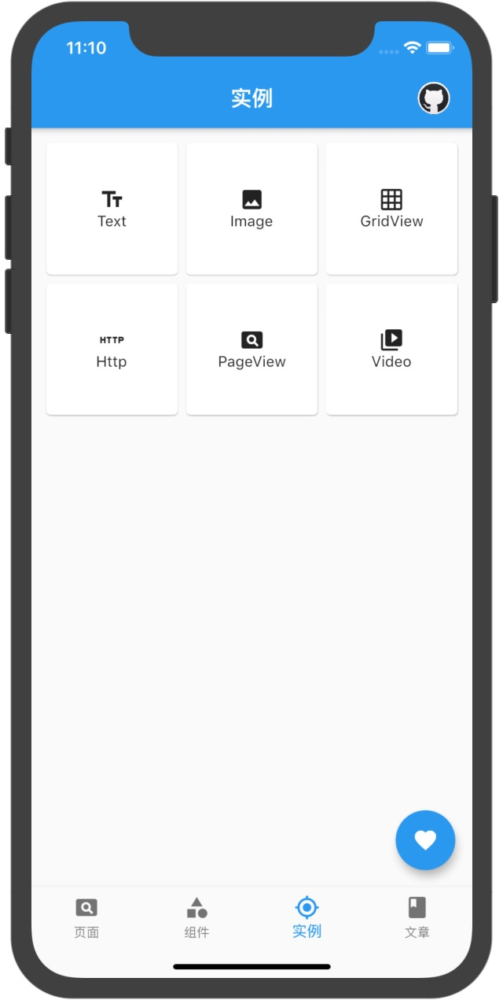
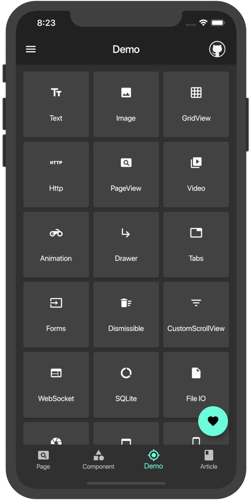
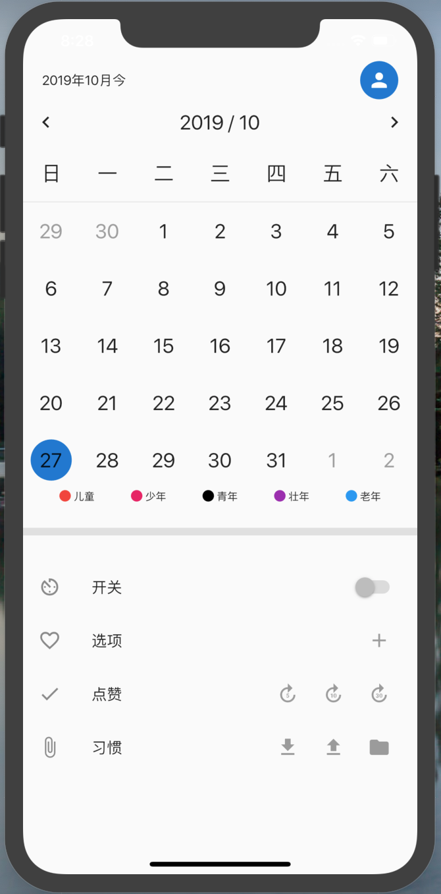
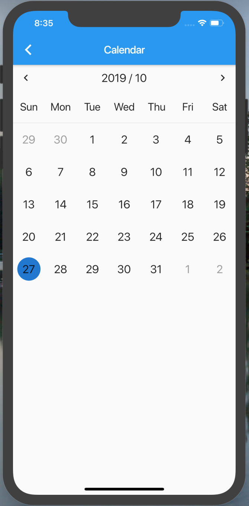
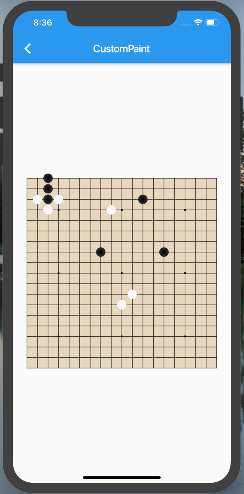
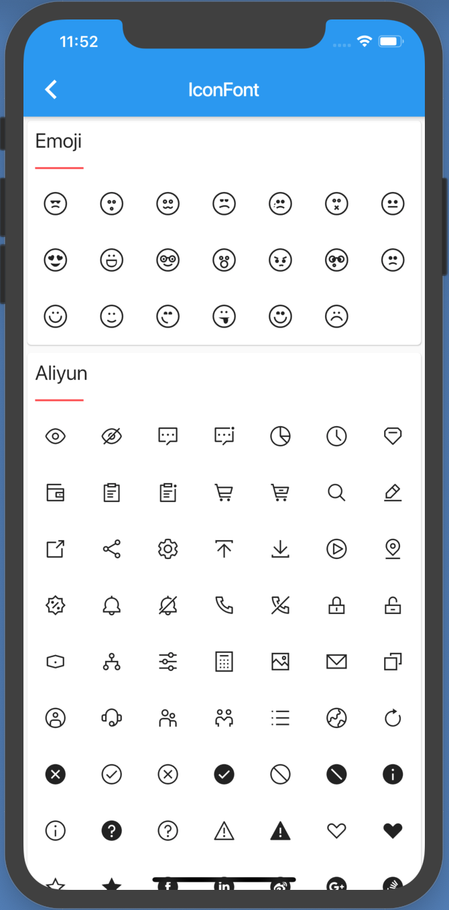

# flutter-system

## 首页

    
    

## 页面

- Guide Page
  
  
  
- Xi You

  

- You Qi

  
  
- Calendar

  
  
- CustomPaint

  
  
- Icon Font
  
  
  
## Demos

- GridView Demo
  
  

     
     
     
     
  

  

## 说明
1. Dart的语法真的相当的ugly，阅读别人写的代码时一定得平心静气，要不然分分钟恶心想吐（其实看自己写的Dart代码也差不多）。

